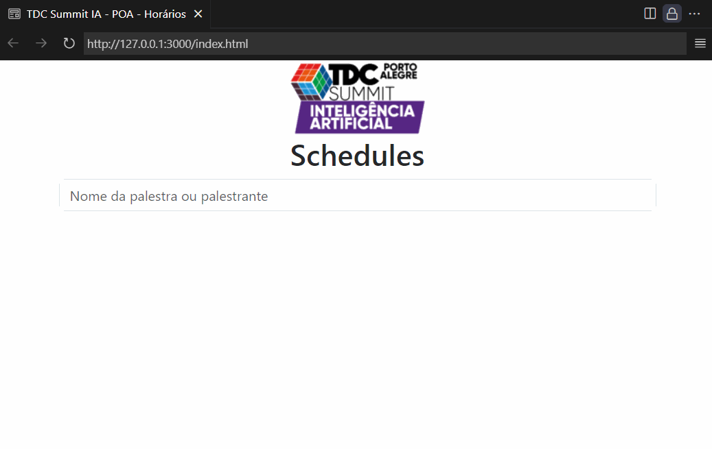

# Página de busca das palestras do TDC Summit IA - POA

### Link produção:
https://bmattosrs.github.io/tdc-schedule/

### Ideia:
Participei da equipe de apoio do evento como voluntário e criei essa página como uma ferramenta de auxílio pessoal (não é endossada pelo TDC) para a minha função, uma vez que precisei orientar os participantes quanto as salas e dias das atividades.

### Solução:
A página __SIMULA uma pesquisa em AJAX__ trazendo o titulo das palestras, nome dos palestrantes, além dos locais e horários.

SIMULA porque para uma consulta em AJAX seria preciso criar um backend, banco de dados, hospedagem, etc., trazendo uma complexidade desnecessária para um projeto de uso pontual (2 dias) e não endossado oficialmente pelo evento.
Por conta disso optei por utilizar Javascript puro. Os dados das palestras estão armazenados em um JSON.

